# Toy Robot Simulator

This is a Ruby command-line application that simulates a toy robot moving on a 5x5 unit square tabletop. The robot can be placed on the table, moved, and rotated, with safeguards to prevent it from falling off.

## Table of Contents

- [Features](#features)
- [Usage](#usage)
  - [Installation](#installation)
  - [Running the Tests](#running-the-tests)
  - [Running the Simulator](#running-the-simulator)
  - [Commands](#commands)
  - [Input Scenarios](#input-scenarios)
- [Design Decisions / Architecture](#design-decisions--architecture)
  - [Core Components](#core-components)
  - [Command Pattern](#command-pattern)
  - [Input Processing](#input-processing)
  - [Error Handling](#error-handling)
- [Test Data](#test-data)
- [What Could Be Improved](#what-could-be-improved)

## Features

- Simulates a toy robot on a 5x5 grid.
- Prevents the robot from falling off the table.
- Supports `PLACE`, `MOVE`, `LEFT`, `RIGHT`, and `REPORT` commands.
- Ignores commands until a valid `PLACE` command is issued.
- Can process commands from standard input or a file.

## Usage

### Installation

This application is written in Ruby 3.4.4. You will need a Ruby environment installed on your system (version 2.7 or higher is recommended). No special gems are required.

#### 1. **Install Ruby**

If you don't already have Ruby installed, I'd recommend using a version manager like rbenv or rvm.

**macOS (with Homebrew)**

```bash
brew install rbenv
rbenv install 3.2.2
rbenv global 3.2.2
```

**Ubuntu/Debian (via `rbenv`)**

```bash
sudo apt update
sudo apt install -y git curl libssl-dev libreadline-dev zlib1g-dev
git clone https://github.com/rbenv/rbenv.git ~/.rbenv
cd ~/.rbenv && src/configure && make -C src
echo 'export PATH="$HOME/.rbenv/bin:$PATH"' >> ~/.bashrc
echo 'eval "$(rbenv init - bash)"' >> ~/.bashrc
exec "$SHELL"
git clone https://github.com/rbenv/ruby-build.git ~/.rbenv/plugins/ruby-build
rbenv install 3.2.2
rbenv global 3.2.2
```

#### 2. **Install Bundler**
Bundler manages Ruby gem dependencies.

```bash
gem install bundler
```

#### 3. Install Project Dependencies
Inside the project directory:

```bash
bundle install
```

### Running the Tests

To run the test suite, you’ll need to have Ruby and Bundler installed. These steps will walk you through getting set up and running tests using RSpec.

#### 1. Run the Test Suite
```bash
rspec
```

#### 2. (Optional) Run a specific test file
```bash
rspec spec/integration_spec.rb
```

### Running the Simulator

The simulator can accept commands from standard input (interactive mode) or from a text file.

#### Interactive Mode (Standard Input)

Run the script directly and type commands into your terminal. Press `Ctrl+D` (Unix/Linux/macOS) or `Ctrl+Z` then `Enter` (Windows) to signal end-of-input and exit.

```bash
ruby run.rb
```

**Example Interactive Session:**

```
PLACE 0,0,NORTH
MOVE
REPORT
0,1,NORTH # <- Output
LEFT
REPORT
0,1,WEST
MOVE
REPORT
0,1,WEST  # <- Output. Robot tried to move off the table (0,1 -> -1,1), so ignored.
PLACE 1,2,EAST
MOVE
MOVE
LEFT
MOVE
REPORT
3,3,NORTH # <- Output
```

#### File Input

Create a text file (e.g., `commands.txt`) containing your desired commands, one command per line.

**`commands.txt` example:**

```
PLACE 0,0,NORTH
MOVE
REPORT
PLACE 0,0,NORTH
LEFT
REPORT
PLACE 1,2,EAST
MOVE
MOVE
LEFT
MOVE
REPORT
INVALID COMMAND HERE
PLACE 5,5,NORTH # This place is invalid
REPORT
```

Then, run the simulator, redirecting the file content as input:

```bash
ruby run.rb < commands.txt
```

**Expected Output for `commands.txt`:**

```
0,1,NORTH
0,0,WEST
3,3,NORTH
Invalid command, please try again
nil # Report after an invalid place command, robot not placed.
```

### Commands

All commands are case-sensitive for directions (e.g., `NORtH`, `north`, `North` are all invalid), so the entire thing must be upper case

-   **`PLACE X,Y,F`**:
    -   Places the robot on the table at coordinates `(X,Y)` facing `F`.
    -   `X` and `Y` are integers from 0 to 4 (inclusive).
    -   `F` can be `NORTH`, `SOUTH`, `EAST`, or `WEST`.
    -   This is the first valid command. All other commands are ignored until a successful `PLACE` command has been executed.
    -   If the `PLACE` command attempts to place the robot off the table, it will be ignored.
    -   Example: `PLACE 0,0,NORTH`

-   **`MOVE`**:
    -   Moves the robot one unit forward in the direction it is currently facing.
    -   If the move would cause the robot to fall off the table, the move is ignored, and the robot's position remains unchanged.

-   **`LEFT`**:
    -   Rotates the robot 90 degrees to the left (counter-clockwise) without changing its position.

-   **`RIGHT`**:
    -   Rotates the robot 90 degrees to the right (clockwise) without changing its position.

-   **`REPORT`**:
    -   Announces the robot's current `X,Y` position and its facing direction `F` to standard output.
    -   Example output: `0,1,NORTH`

### Input Scenarios

-   **Initial Placement**: The very first command *must* be `PLACE`. Any other command will be ignored until a valid `PLACE` command is processed.
    ```
    MOVE
    REPORT
    PLACE 0,0,NORTH
    REPORT
    # Output:
    # 0,0,NORTH
    ```
-   **Invalid Placement**: If `PLACE` specifies coordinates off the table (e.g., `5,0,NORTH`), it will be ignored.
    ```
    PLACE 5,0,NORTH
    REPORT
    # Output: (nothing, or just a new line, as robot is not placed)
    # nil
    ```
-   **Preventing Falls**: `MOVE` commands that would lead to a fall are ignored.
    ```
    PLACE 0,0,WEST
    MOVE
    REPORT
    # Output:
    # 0,0,WEST (move was ignored)
    ```
-   **Re-placing the Robot**: A `PLACE` command can be issued at any time to move the robot to a new valid position and direction.
    ```
    PLACE 0,0,NORTH
    MOVE
    REPORT
    PLACE 3,3,SOUTH
    REPORT
    # Output:
    # 0,1,NORTH
    # 3,3,SOUTH
    ```

## Test Data

The problem description provides the following example test cases:

**Test Case 1:**

```
PLACE 0,0,NORTH
MOVE
REPORT
```

**Expected Output:** `0,1,NORTH`

**Test Case 2:**

```
PLACE 0,0,NORTH
LEFT
REPORT
```

**Expected Output:** `0,0,WEST`

**Test Case 3:**

```
PLACE 1,2,EAST
MOVE
MOVE
LEFT
MOVE
REPORT
```

**Expected Output:** `3,3,NORTH`

**Additional Test Cases (to cover edge cases and error handling):**

**Test Case 4 (Initial invalid commands):**

```
MOVE
LEFT
REPORT
PLACE 2,2,SOUTH
REPORT
```
**Expected Output:**
```
2,2,SOUTH
```
*(MOVE, LEFT, REPORT ignored before valid PLACE)*

**Test Case 5 (Attempting to fall off the edge):**

```
PLACE 0,0,SOUTH
MOVE
REPORT
PLACE 4,4,NORTH
MOVE
REPORT
PLACE 0,4,NORTH
MOVE
REPORT
PLACE 4,0,EAST
MOVE
REPORT
```
**Expected Output:**
```
0,0,SOUTH
4,4,NORTH
0,4,NORTH
4,0,EAST
```
*(All `MOVE` commands should be ignored as they would lead to falling)*

**Test Case 6 (Invalid PLACE coordinates):**

```
PLACE 5,0,NORTH
REPORT
PLACE 0,5,EAST
REPORT
PLACE -1,0,SOUTH
REPORT
PLACE 0,-1,WEST
REPORT
PLACE 2,2,NORTH
REPORT
```
**Expected Output:**
```
nil
nil
nil
nil
2,2,NORTH
```
*(First four `PLACE` commands are invalid and ignored, robot is only placed by the last one)*

**Test Case 7 (Invalid PLACE direction):**

```
PLACE 0,0,UP
REPORT
PLACE 1,1,NORTH
REPORT
```
**Expected Output:**
```
Invalid command, please try again
1,1,NORTH
```
*(`PLACE 0,0,UP` fails due to invalid direction, robot remains unplaced until `PLACE 1,1,NORTH`)*

**Test Case 8 (Mixed commands and re-placement):**

```
PLACE 0,0,NORTH
MOVE
RIGHT
MOVE
REPORT
PLACE 4,4,SOUTH
LEFT
MOVE
REPORT
```
**Expected Output:**
```
1,1,EAST
3,4,EAST
```

## Design Decisions / Architecture

The application is structured using an object-oriented approach using the Command and Strategy patterns



### Core Components

- Table:
    - Represents the 5x5 tabletop.
    - Its primary responsibility is to validate if a given `position` is within its boundaries (`valid_position?`).
    - Defaults to a 5x5 size, but could be extended to support custom dimensions.

- Robot:
    - Represents the toy robot itself.
    - Holds its current `position` and `direction`.
    - Manages its `placed?` state, ensuring commands are ignored before placement.
    - Provides methods for `place`, `move`, `turn`, `report` and `next_position`
    - Crucially, the `Robot` does not know about the `Table`'s boundaries; it only calculates its `next_position`. The `Table` is responsible for validating this position.

- Direction
    - Encapsulates the concept of direction (NORTH, EAST, SOUTH, WEST).
    - Handles rotation logic (using the `turn` method).
    - Provides coordinate deltas (`coordinate_delta`) for position calculations.
    - Uses a `DIRECTION_NAMES` array and `COORDINATE_DELTAS` hash for efficient lookup and rotation.

- Position:
    - A simple value object representing X,Y coordinates.
    - overrides == for easy comparison of positions.

-  ToyRobotSimulator:
    -   The main orchestrator of the application.
    -   Initialises the `Table` and `Robot`.
    -   The `execute_command` method takes a raw input string, delegates parsing to `InputParser`, and then executes the resulting command.
    -   The `run` method iterates over lines from an input source (defaulting to `$stdin`), allowing for both interactive and file-based input.

### Command Pattern

The application heavily utilises the [Command Pattern](https://refactoring.guru/design-patterns/command) to handle different robot actions:

-   Commands::Base:
    -   An abstract base class for all commands.
    -   Holds references to the `robot`, `table`, and `output` stream.
    -   Defines the `execute` interface that all concrete commands must implement.
    -   Includes a `robot_placed?` helper to ensure commands are only executed if the robot is on the table.

-   Concrete Command Classes:
    -   Each class encapsulates a specific action.
    -   The `execute` method for each command contains the logic for that particular action.
    -   This design separates the action from the object that invokes the action (the simulator), making it easy to add new commands or modify existing ones without altering the core simulation logic.
    -   `Commands::Invalid` is a special command that does nothing, effectively ignoring unrecognised or invalid commands as per the requirements. This opens us up for better error handling / logging in the future

### Input Processing using a Strategy Pattern

The command parsing system uses a [Strategy Pattern with Chain of Responsibility](https://refactoring.guru/design-patterns/strategy) to handle different types of user input. The `InputParser` tries each parser strategy in sequence until one can handle the input, falling back to an Invalid command if none match.

**Two-Parser Split Rationale**: The PLACE command is fundamentally different from other commands. It requires complex parameter parsing (coordinates and direction) with regex validation, while MOVE/LEFT/RIGHT/REPORT are simple, parameterless commands requiring only exact string matching. This separation keeps the simple command parser lightweight and gives PLACE the sophisticated parsing logic it needs, following the single responsibility principle and making the code more maintainable.

### Error Handling

-   **Invalid Commands**: Commands issued before a successful `PLACE` command, or syntactically incorrect commands, are parsed into `Commands::Invalid` objects and are effectively ignored, fulfilling the requirement to discard invalid commands.
-   **Falling Off**: The `Table#valid_position?` method is crucial. Before a `MOVE` command is executed, the `Robot` calculates its `next_position`. This position is then validated by the `Table`. If the `next_position` is off the table, the `MOVE` command's `execute` method simply does nothing, preventing the robot from falling.

## What Could Be Improved

Given more time, I would consider the following enhancements:
### Error handling
Users don't know if what they've written is valid until they've run the REPORT command

### Logging

Very little visibility into what users are doing, what kinds of mistakes they're making, how much they're struggling. 

### Naming

I would change LEFT and RIGHT to "TURN_LEFT" "TURN_RIGHT". It's not so clear that LEFT and RIGHT relate to turning but not moving and it might end up confusing people. It's a trade off between a better documenting API but with more verbose commands. 

### User interface

#### "Look" command
I would have liked to add a feature to allow users to inspect the board and where the robot was
#### Undo / repeat functionality
Allow the user to easily undo or repeat a command without having to type it in again or perform the reverse. If a user has PLACE 2,2,NORTH and then does MOVE and realises "Oh crap i wanted to go the other way, they can't easily undo that"
#### Permit case insensitivity
The requirements didn't say anything about allowing case insensitivity so i was strict in not permitting, say "place 0,0,north". 

### Code quality

#### Stronger typing
Sorbet could be handy here, i've gotten a bit used to types at Indeed Flex and being able to see what kind of attributes we're dealing with "x" and "y" would be useful

#### Diverging behaviour between a placed robot and non-placed robot

We might want to think about having two different types of robot here if the behaviour increasingly diverges e.g [State pattern](https://refactoring.guru/design-patterns/state). We need to keep checking if the robot is placed before executing methods. 
